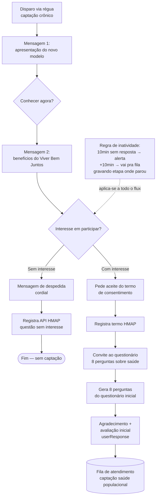

# Fluxo de Captação — Viver Bem Juntos (Unimed Porto Alegre)

Documentação do fluxo de captação de beneficiários no chatbot (Blip), modelo assistencial **Viver Bem Juntos**.

> Fonte: Miro — "Aceleração Tecnológica Modelo Assistencial"
> Escopo deste documento: **Alta Complexidade** — da régua de captação crônico até a entrada na fila de atendimento da saúde populacional.

---

## 1. Alta Complexidade — Captação crônico

### 1.1 Visão geral

### 1.2 Mensagens (copy)

**Mensagem 1 — abertura**
> Olá! Teu plano de saúde mudou. Agora, a Unimed Porto Alegre tem um novo jeito de cuidar de ti.
>
> Vamos te acompanhar em toda a tua jornada de saúde, com uma equipe pronta para te ajudar — e o melhor: sem custo adicional.
>
> Conheça o modelo de cuidado **Viver Bem Juntos**.

Botão: **Conhecer agora**

**Mensagem 2 — apresentação dos benefícios**
> Com o Viver Bem Juntos, cada pessoa recebe um plano de cuidado personalizado. Vou te contar os principais benefícios:
>
> ✅ Ações de promoção da saúde e prevenção de doenças
> 🧘 Autocuidado apoiado
> 👩‍⚕️ Suporte direto da equipe de gestão em saúde
>
> Tudo isso é gratuito, sem cobrança adicional. 💙
>
> Gostaria de participar e aproveitar os benefícios?

Decisão: **Sem interesse** / **Com interesse**

---

### 1.3 Ramo — Sem interesse

**Mensagem de despedida**
> Agradecemos por tua resposta!
>
> Sempre que precisar, é só falar com a gente por aqui.
>
> A Unimed Porto Alegre deseja {{um/uma}} {{periodoDia}}!
> Até mais! 👋

Botão: **ok**

**Ação no sistema:** registra via API no HMAP a resposta "questão sem interesse".

**Resultado:** encerra o fluxo; cliente não é captado.

---

### 1.4 Ramo — Com interesse

#### Passo 1 — Aceite do termo
> Ficamos felizes com teu interesse! Será um prazer cuidar de ti. 💙
>
> Para continuar, preciso do teu aceite no termo de consentimento.
>
> **Ler termo e aceitar**

Botão: **ok**
**Ação:** registra termo de consentimento no HMAP.

#### Passo 2 — Convite ao questionário
> Que bom te ter no Viver Bem Juntos!
>
> Agora queremos saber um pouco mais sobre tua saúde. São apenas **8 perguntas simples**.
>
> Selecione o botão abaixo para responder.

**Ação:** dispara fluxo de 8 perguntas do questionário inicial.

#### Passo 3 — Encerramento e avaliação inicial
> Agradecemos por compartilhar mais detalhes sobre tua saúde! 🙌
>
> **Avaliação Inicial:** {{userResponse}}
>
> Com base nas tuas respostas, vamos te oferecer um cuidado personalizado. Até breve!

**Ação:** envia o beneficiário para a **Fila de atendimento — captação saúde populacional**.

---

### 1.5 Regra transversal — Inatividade

Aplica-se a qualquer ponto do fluxo com interesse:

- **10 min sem resposta** → cliente é chamado novamente.
- **+10 min sem resposta** (20 min total) → é movido para a fila de captação saúde populacional, com a **etapa em que parou gravada** para continuidade posterior.

---

## 2. Pendências / decisões em aberto

Itens sinalizados no board que ainda precisam de definição antes do go-live:

| # | Pendência | Tipo | Responsável |
|---|-----------|------|-------------|
| 1 | Desenhar fluxo do cliente que **não interagiu** com a mensagem inicial (sem resposta nenhuma) | Fluxo | — |
| 2 | Como identificar **validador único por CPF no Blip** (evitar duplicidade de captação) | Técnica | — |
| 3 | Verificar **idade mínima de rastreamento** (quem entra na régua crônico) | Regra de negócio | — |
| 4 | Proposta de **4 templates** para cliente sem interação (reengajamento) | Copy | — |

---

## 3. Integrações citadas

| Sistema | Uso neste fluxo |
|---------|-----------------|
| **Blip** | Orquestração do chatbot, régua de captação, identificação do contato |
| **HMAP** | Registro de consentimento (termo) e respostas (sem interesse, questionário) via API |
| **Fila saúde populacional** | Destino final para beneficiários captados ou com timeout de inatividade |

---

## 4. Próximas seções (a documentar)

- [ ] Alta Complexidade — continuação (triagem healthshop, TAG Captado, ativação PCA, cliente acessa APP)
- [ ] Baixa e Baixíssima Complexidade (régua autocuidado / promoção de saúde)
